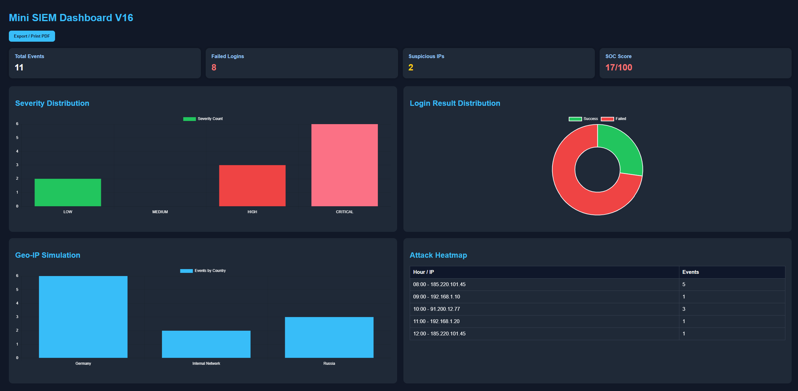
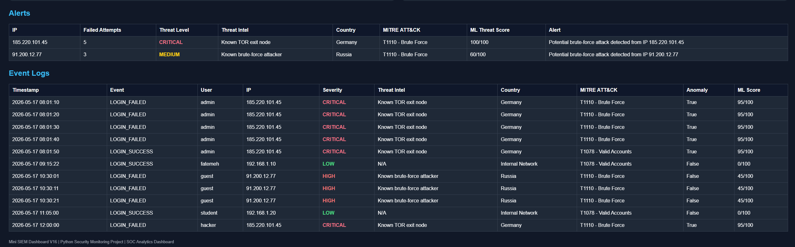

# Mini SIEM Dashboard V16

A Python-based Cybersecurity SIEM (Security Information and Event Management) Dashboard designed for SOC monitoring, threat detection, attack visualization, and security analytics.

---

## Features

### V1 – V16 Security Features

- Log Parsing Engine
- Failed Login Detection
- Brute Force Detection
- JSON Report Export
- SOC Security Score
- HTML Dashboard
- Real-Time Monitoring
- Threat Intelligence Simulation
- MITRE ATT&CK Mapping
- Geo-IP Simulation
- Severity Classification
- ML Threat Scoring Simulation
- Attack Heatmap
- Security Analytics Charts
- PDF Report Export
- Modular SIEM Architecture

---

# Dashboard Preview

## Main Dashboard



---

## Analytics Dashboard



---

# Technologies Used

- Python 3
- HTML5
- CSS3
- JavaScript
- Chart.js
- JSON
- GitHub Pages

---

# Project Structure

```text
mini-siem-dashboard/
│
├── logs/
│   └── auth_logs.txt
│
├── reports/
│   ├── security_report.txt
│   ├── siem_results.json
│   └── index.html
│
├── screenshots/
│   ├── dashboard-overview-v16.png
│   └── dashboard-analytics-v16.png
│
├── config.py
├── detector.py
├── parser.py
├── reporter.py
├── threat_intel.py
├── siem.py
├── requirements.txt
└── README.md
```

---

# Threat Detection Capabilities

## Attack Detection

- Brute-force login attacks
- Suspicious IP monitoring
- Critical severity escalation
- Threat intelligence correlation
- MITRE ATT&CK mapping

---

# Dashboard Analytics

The SIEM dashboard provides:

- Severity Distribution
- Login Success vs Failure Analysis
- Geo-IP Attack Simulation
- Attack Heatmap
- Threat Intelligence Table
- ML Threat Scores

---

# MITRE ATT&CK Techniques

| Technique ID | Description |
|---|---|
| T1110 | Brute Force |
| T1078 | Valid Accounts |

---

# Machine Learning Simulation

This project simulates ML-based threat scoring:

| Score Range | Risk Level |
|---|---|
| 0–30 | Low |
| 31–70 | Medium |
| 71–100 | Critical |

---

# How to Run

## Install Requirements

```bash
pip install -r requirements.txt
```

---

## Run the SIEM Engine

```bash
python siem.py
```

---

# GitHub Pages Dashboard

Live Dashboard:

```text
https://fsetareh.github.io/mini-siem-dashboard/
```

---

# Future Improvements

- Real SIEM API integration
- Live socket monitoring
- Splunk-style analytics
- AI anomaly detection
- Threat intelligence APIs
- Interactive filtering
- User authentication system

---

# Author

Fatemeh Setareh

Cybersecurity & AI Student  
Centennial College  
Toronto, Canada

---

# License

This project is for educational and portfolio purposes.